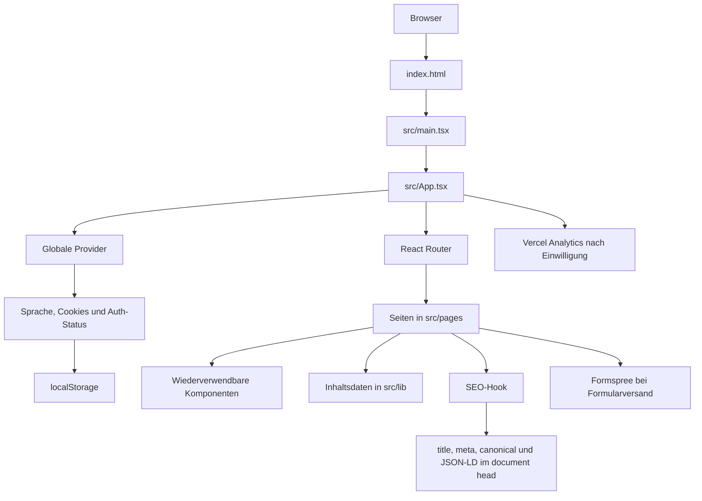

# RAWR - Recruitment AI Workforce Revolution GmbH

> Technische Projektdokumentation einer mehrsprachigen Unternehmenswebsite mit Fokus auf Webentwicklung, SEO, GEO, Datenschutz und Qualitätssicherung.

**Live-Domain:** [https://rawr.solutions](https://rawr.solutions)

**Projektart:** studentische Arbeit / Demonstrationsprojekt

**Technischer Stand:** 9. Juni 2026

## 1. Projektüberblick

RAWR ist eine fiktive Unternehmenswebsite für eine Beratung im Bereich KI-Enablement, HR-Automatisierung und Responsible AI. Die Website soll zeigen, wie ein moderner B2B-Webauftritt technisch und inhaltlich umgesetzt werden kann.

Das Projekt kombiniert:

- eine responsive und animierte Landingpage,
- eigenständige Inhalts- und Marketingseiten,
- deutsch-, englisch- und französischsprachige Inhalte,
- technische Suchmaschinenoptimierung,
- Ansätze für Generative Engine Optimization,
- lokale geografische Signale für Heilbronn,
- einen Cookie-Consent-Mechanismus,
- ein Kontaktformular,
- einen rein clientseitigen Demo-Login mit Rollenmodell,
- automatisierte Tests und einen reproduzierbaren Produktionsbuild.

Alle dargestellten Leistungen, Kennzahlen, Referenzen und Unternehmensdaten sind Teil eines studentischen Demonstrationsprojekts. Sie müssen vor einer realen geschäftlichen Nutzung fachlich und rechtlich geprüft werden.

## 2. Zielsetzung

Ziel des Projekts ist die Konzeption und technische Umsetzung einer glaubwürdigen digitalen Präsenz für ein fiktives KI-Beratungsunternehmen. Im Mittelpunkt stehen drei Fragestellungen:

1. Wie lässt sich eine moderne, responsive Unternehmenswebsite modular mit React umsetzen?
2. Wie können Inhalte und technische Signale für klassische Suchmaschinen optimiert werden?
3. Wie können Informationen so strukturiert werden, dass auch generative Such- und Antwortsysteme die Organisation und ihre Themen möglichst eindeutig verstehen können?

Die Website wurde deshalb nicht nur visuell gestaltet. Navigation, Inhaltsstruktur, Metadaten, strukturierte Daten, Crawl-Dateien, Mehrsprachigkeit, Datenschutz und technische Qualität wurden als zusammenhängendes System betrachtet.

## 3. Funktionsumfang

### Öffentlicher Website-Bereich

- Landingpage mit Hero, Leistungen, Prozess, Case Studies, Testimonial, FAQ-Teaser und Call-to-Action
- Marketingseiten für Leistungen, Case Studies, Referenzen, Lizenzen, Blog und digitale Produkte
- Unternehmens- und Teamvorstellung
- ausführliche FAQ-Seite
- Kontaktformular mit Validierung und Formspree-Anbindung
- Datenschutz- und Impressumsseite
- globale Navigation und interne Verlinkung
- responsives Desktop- und Mobile-Menü

### Technische Zusatzfunktionen

- Umschaltung zwischen Deutsch, Englisch und Französisch
- dynamische, seiten- und sprachabhängige SEO-Metadaten
- strukturierte Daten nach Schema.org
- `robots.txt`, XML-Sitemap und `llms.txt`
- Canonical-URLs und permanente Weiterleitungen für Alias-URLs
- `noindex` für Login, Adminbereich, Kundenportal und 404-Seiten
- Cookie-Einstellungen für optionale Analyse
- Vercel Analytics und Speed Insights erst nach Zustimmung
- Demo-Authentifizierung mit Admin- und Kundenrolle
- automatisierte Komponenten- und Verhaltenstests

## 4. Verwendete Technologien

| Bereich | Technologie | Aufgabe im Projekt |
|---|---|---|
| Frontend | React 18 | Komponentenbasierter Aufbau und Zustandsverwaltung |
| Programmiersprache | TypeScript | Typisierung von Komponenten, Daten und Hilfsfunktionen |
| Build-System | Vite | Entwicklungsserver und Produktionsbuild |
| Routing | React Router | Clientseitige Navigation zwischen Seiten |
| Styling | Tailwind CSS | Responsive Layouts und Utility-basiertes Styling |
| UI-Basis | shadcn/ui und Radix UI | Zugängliche Dialoge, Formulare, Accordion und weitere UI-Komponenten |
| Animation | Framer Motion | Einblendungen und Scroll-Animationen |
| Icons | Lucide React | Einheitliche Vektor-Icons |
| Formulare | React Hook Form und Zod | Formularzustand und Eingabevalidierung |
| Analyse | Vercel Analytics und Speed Insights | Optionale Nutzungs- und Performanceanalyse |
| Tests | Vitest, Testing Library und jsdom | Automatisierte Frontend-Tests |
| Hosting-Konfiguration | Vercel | Redirects, Header und Deployment-Konfiguration |

## 5. Systemarchitektur

Die Anwendung ist als **Single-Page-Application (SPA)** umgesetzt. Beim ersten Aufruf wird `index.html` geladen. Anschließend startet React die Anwendung und React Router übernimmt die Navigation, ohne bei jedem Seitenwechsel ein vollständiges HTML-Dokument neu anzufordern.



### 5.1 Einstiegspunkt und globale Provider

`src/main.tsx` bindet die lokalen Schriftarten und das globale Stylesheet ein und rendert die React-Anwendung in das Element `#root`.

`src/App.tsx` stellt die globale Anwendungsstruktur bereit. Dort werden folgende Provider und Funktionen zusammengeführt:

- `QueryClientProvider` als vorbereitete Datenabfrage-Infrastruktur,
- `TooltipProvider` für UI-Komponenten,
- globale Toast-Benachrichtigungen,
- `BrowserRouter` für das Routing,
- `LanguageProvider` für die Mehrsprachigkeit,
- Navigation und Footer,
- Cookie-Banner und zustimmungsabhängige Analyse,
- geschützte Routen für Admin- und Kundenbereich.

### 5.2 Routing

Die Routen werden zentral in `src/App.tsx` definiert.

| Route | Inhalt | Indexierung |
|---|---|---|
| `/` | Landingpage | erlaubt |
| `/leistungen` | Leistungen | erlaubt |
| `/case-studies` | Fallstudien | erlaubt |
| `/referenzen` | Referenzen | erlaubt |
| `/lizenzen` | Lizenzmodelle | erlaubt |
| `/unternehmen` | Unternehmen und Team | erlaubt |
| `/blog` | Blog-Übersicht | erlaubt |
| `/shop` | digitale Produkte | erlaubt |
| `/fragen` | FAQ | erlaubt |
| `/kontakt` | Kontaktformular | erlaubt |
| `/datenschutz` | Datenschutzerklärung | erlaubt |
| `/impressum` | Impressum | erlaubt |
| `/login` | Demo-Login | `noindex` |
| `/admin` | geschützter Adminbereich | `noindex` |
| `/portal` | geschütztes Kundenportal | `noindex` |
| alle unbekannten Routen | 404-Seite | `noindex` |

Die Alias-Routen `/ueber-uns`, `/ueberuns`, `/serviceleistungen`, `/digitale-produkte` und `/licences` werden über `vercel.json` permanent auf die bevorzugten URLs weitergeleitet. Dadurch werden doppelte Inhalte und konkurrierende URLs reduziert.

### 5.3 Komponentenarchitektur

Die Website ist in wiederverwendbare Komponenten aufgeteilt:

```text
src/
  assets/                  Bilder und Team-Assets
  components/
    auth/                  Route Guard für geschützte Bereiche
    landing/               Abschnitte der Landingpage
    ui/                    wiederverwendbare shadcn/ui-Komponenten
  hooks/                   eigene React Hooks
  lib/                     Inhalte, SEO, i18n, Auth und Cookie-Logik
  pages/                   vollständige Routenseiten
  test/                    automatisierte Tests
```

Die Landingpage besteht beispielsweise nicht aus einer großen Komponente, sondern aus einzelnen Abschnitten wie `Hero`, `Services`, `Process`, `CaseStudies`, `FAQ` und `CTA`. Das vereinfacht Wartung, Wiederverwendung und Weiterentwicklung.

### 5.4 Datengetriebene Marketingseiten

Die Seiten für Leistungen, Referenzen, Lizenzen, Case Studies, Blog und Shop verwenden dieselbe Seitenschablone:

```text
src/pages/MarketingPage.tsx
```

Die unterschiedlichen Inhalte liegen strukturiert in:

```text
src/lib/marketing-pages.ts
```

Jeder Seiteneintrag enthält unter anderem Titel, Einleitung, Statistiken, Call-to-Actions und Inhaltskarten. `MarketingPage.tsx` rendert daraus die jeweilige Seite. Dieses Vorgehen reduziert duplizierten Code und sorgt für ein konsistentes Layout.

### 5.5 Gestaltung und Responsive Design

Das visuelle System basiert auf Tailwind CSS und eigenen CSS-Variablen in `src/index.css`.

Wesentliche Gestaltungsentscheidungen:

- dunkle Indigo-Farbwelt mit zentral definierten HSL-Farbwerten,
- wiederverwendbare Verläufe, Oberflächen und Schatten,
- `Space Grotesk` für Überschriften und `DM Sans` für Fließtext,
- responsive Breakpoints für Mobilgeräte, Tablets und Desktop,
- Grid- und Flexbox-Layouts,
- Animationen mit Framer Motion,
- wiederverwendbare Varianten für Buttons und UI-Komponenten.

Die Schriften werden über `@fontsource` lokal in den Build integriert. Dadurch ist für die Schriftanzeige kein externer Google-Fonts-Aufruf erforderlich.

### 5.6 Mehrsprachigkeit

Die Mehrsprachigkeit wird ohne externe i18n-Bibliothek über einen eigenen React Context in `src/lib/i18n.tsx` umgesetzt.

Der Ablauf:

1. Beim ersten Aufruf wird eine gespeicherte Sprache aus `localStorage` gelesen.
2. Falls keine Auswahl vorhanden ist, wird die Browsersprache geprüft.
3. Unterstützt werden `de`, `en` und `fr`; ansonsten wird Deutsch verwendet.
4. Der `LanguageProvider` stellt die aktuelle Sprache und die Übersetzungsfunktion `t()` bereit.
5. Der `LanguageSwitcher` speichert Änderungen in `localStorage`.
6. Der SEO-Hook passt den `lang`-Wert des HTML-Dokuments und sprachabhängige Metadaten an.

Globale UI-Texte liegen in `src/lib/i18n.tsx`. Umfangreichere Seiteninhalte werden direkt in den jeweiligen Inhaltsmodulen oder Seiten nach Sprache strukturiert.

### 5.7 Kontaktformular

Das Kontaktformular in `src/pages/Contact.tsx` nutzt:

- React Hook Form für Formularzustand und Fehlermeldungen,
- Zod für die Validierung von Name, E-Mail und Nachricht,
- Formspree als externen Formular-Endpunkt,
- Toast-Nachrichten als Erfolgs- oder Fehlerrückmeldung.

Beim Absenden werden die Formulardaten als JSON an Formspree übertragen. Das Projekt besitzt kein eigenes Backend. Zusätzlich schreibt die aktuelle Demonstration ein simuliertes Analytics-Ereignis inklusive Formularwerten in die Browserkonsole. Für einen produktiven Betrieb müssten diese Protokollierung entfernt sowie Formspree-Konfiguration, Datenschutzerklärung, Spam-Schutz und Auftragsverarbeitung geprüft werden.

### 5.8 Demo-Authentifizierung

Der Login ist eine rein clientseitige Demonstration und keine produktionsgeeignete Authentifizierung.

Die Umsetzung in `src/lib/auth.ts` umfasst:

- Admin- und Kundenrollen,
- SHA-256-Hashing der Demo-Passwörter über die Web Crypto API,
- Speicherung von Konten und Sitzung in `localStorage`,
- rollenbasierte Weiterleitung,
- geschützte Routen über `RequireAuth`,
- Anlegen von Demo-Konten im Adminbereich.

Da Konten, Hashes und Sitzungen vollständig im Browser liegen, bietet diese Lösung keinen Schutz gegen manipulierte Clients. Ein realer Einsatz erfordert ein Backend, serverseitige Sitzungen, sichere Passwortverfahren, Zugriffskontrollen und eine Datenbank.

## 6. Suchmaschinenoptimierung (SEO)

SEO wurde auf technischer, inhaltlicher und struktureller Ebene umgesetzt.

### 6.1 Statische Basis-Metadaten

`index.html` enthält die Basisinformationen, die bereits vor dem Start der React-Anwendung verfügbar sind:

- Seitentitel und Meta-Description,
- `robots`- und `googlebot`-Direktiven,
- Canonical-Link,
- Autor und Anwendungsname,
- Open-Graph-Metadaten,
- Twitter-Card-Metadaten,
- Favicon, Apple-Touch-Icon und Web-App-Manifest,
- grundlegende strukturierte Daten für Organisation und Website.

Diese Basis ist besonders relevant, weil eine SPA zunächst nur ein gemeinsames HTML-Dokument ausliefert.

### 6.2 Dynamische seitenbezogene Metadaten

Die zentrale SEO-Logik liegt in:

```text
src/lib/seo.ts
```

Der Hook `usePageSeo()` wird von den einzelnen Seiten aufgerufen und aktualisiert nach einem Routen- oder Sprachwechsel:

- `document.title`,
- Meta-Description,
- Robots-Direktiven,
- Canonical-URL,
- Open-Graph-Titel, Beschreibung, URL, Bild und Locale,
- Twitter-Card-Daten,
- Sprache des HTML-Dokuments,
- seitenbezogene JSON-LD-Daten.

Dadurch erhalten die indexierbaren Seiten eigene Titel, Beschreibungen und Canonical-URLs, obwohl sie innerhalb einer React-SPA gerendert werden.

### 6.3 Canonical-URLs und Redirects

Für jede Seite wird eine bevorzugte absolute URL unter `https://rawr.solutions` erzeugt. Alias-URLs werden in `vercel.json` permanent weitergeleitet.

Diese Kombination verfolgt zwei Ziele:

- Suchmaschinen sollen nur eine bevorzugte URL pro Inhalt indexieren.
- Bereits verwendete oder alternative Schreibweisen bleiben erreichbar.

### 6.4 Robots-Steuerung und Sitemap

`public/robots.txt` erlaubt grundsätzlich das Crawling und verweist auf die Sitemap.

`public/sitemap.xml` listet die öffentlich indexierbaren Kernseiten mit:

- URL,
- Änderungsdatum,
- erwarteter Änderungsfrequenz,
- relativer Priorität.

Nicht öffentliche oder für Suchergebnisse ungeeignete Bereiche werden auf zwei Ebenen ausgeschlossen:

- clientseitig mit `noindex, nofollow, noarchive` über `usePageSeo()`,
- für `/login`, `/admin` und `/portal` zusätzlich mit dem HTTP-Header `X-Robots-Tag` in `vercel.json`.

Die HTTP-Header sind robuster als ausschließlich clientseitig gesetzte Meta-Tags, weil Crawler sie bereits in der Serverantwort sehen.

### 6.5 Strukturierte Daten

Die Website verwendet JSON-LD nach [Schema.org](https://schema.org). Die Hilfsfunktionen dafür liegen in `src/lib/seo.ts`.

Verwendete Typen:

| Schema-Typ | Verwendung |
|---|---|
| `Organization` | Unternehmensidentität |
| `ProfessionalService` | Einordnung als professionelle Dienstleistung |
| `WebSite` | Beschreibung der Website |
| `WebPage` | allgemeine Inhaltsseiten |
| `AboutPage` | Unternehmensseite |
| `ContactPage` | Kontaktseite |
| `FAQPage` | FAQ-Seite |
| `BreadcrumbList` | Einordnung einer Seite in die Informationsarchitektur |
| `Question` und `Answer` | maschinenlesbare FAQ-Inhalte |

Die strukturierten Daten verknüpfen Seiten über feste `@id`-Werte mit der Organisation und Website. Das hilft Suchmaschinen, die dargestellte Entität und ihre Inhalte konsistent zuzuordnen.

### 6.6 Inhaltliche und semantische Optimierung

Die Seiten verwenden:

- pro Seite eine zentrale `h1`,
- hierarchische `h2`- und `h3`-Überschriften,
- beschreibende Seitentitel und Einleitungen,
- thematisch relevante Begriffe wie HR-Automatisierung, Recruiting und Responsible AI,
- interne Links zwischen verwandten Inhalten,
- klare Call-to-Actions,
- Alt-Texte für relevante Bilder,
- semantische Elemente wie `main`, `section`, `article`, `nav` und `footer`.

Interne Navigation und Breadcrumb-Strukturdaten unterstützen sowohl Nutzende als auch Suchmaschinen beim Verständnis der Seitenstruktur.

### 6.7 Social Sharing

Open-Graph- und Twitter-Card-Metadaten definieren, wie Links zu RAWR auf sozialen Plattformen dargestellt werden. Titel, Beschreibung, URL und Vorschaubild werden vom SEO-Hook für die aktive Seite angepasst.

## 7. Generative Engine Optimization (GEO)

Im Kontext dieses Projekts bezeichnet GEO die Optimierung für generative Such- und Antwortsysteme. Ziel ist, Inhalte für Systeme verständlich und eindeutig aufzubereiten, die Antworten aus Webquellen zusammenstellen.

### 7.1 Umgesetzte GEO-Maßnahmen

Die Website enthält folgende Ansätze:

- eine klar definierte Organisation mit konsistentem Namen, URL, Themenfeldern und Kontaktinformationen,
- JSON-LD zur maschinenlesbaren Beschreibung der Entität,
- eindeutig strukturierte Leistungs-, Unternehmens- und FAQ-Inhalte,
- konkrete Fragen und vollständige Antworten auf der FAQ-Seite,
- Breadcrumbs und interne Verlinkung zur Einordnung von Inhalten,
- thematisch fokussierte Texte statt rein werblicher Schlagworte,
- eine Datei `public/llms.txt` mit Kernthemen, wichtigen Seiten, Kurzbeschreibung und Hinweis auf den studentischen Charakter.

`llms.txt` ist ein experimenteller Ansatz und kein verbindlicher Webstandard. Die Datei kann Sprachmodellen und anderen automatisierten Systemen eine kompakte Orientierung geben, garantiert aber weder Crawling noch Zitierung.

### 7.2 Grenzen der aktuellen GEO-Umsetzung

Für eine stärkere GEO-Wirkung wären zusätzlich sinnvoll:

- fachlich belegte Aussagen mit nachvollziehbaren Primärquellen,
- reale Autorenprofile und fachliche Qualifikationen,
- datierte Fachartikel mit stabilen Einzel-URLs,
- reale Fallstudien mit Methodik und überprüfbaren Ergebnissen,
- regelmäßige Aktualisierung der Inhalte,
- Erwähnungen und Verlinkungen durch unabhängige, vertrauenswürdige Quellen.

Da RAWR ein fiktives studentisches Projekt ist, dürfen die aktuellen Inhalte und Kennzahlen nicht als unabhängige Belege für reale Geschäftstätigkeit interpretiert werden.

## 8. Lokale geografische Optimierung

Zusätzlich zur Generative Engine Optimization enthält das Projekt geografische Signale für den Standort Heilbronn.

In `index.html` werden folgende Angaben gesetzt:

- `geo.region` mit `DE-BW`,
- `geo.placename` mit Heilbronn,
- geografische Koordinaten über `geo.position` und `ICBM`.

Die strukturierten Organisationsdaten ergänzen:

- Postanschrift in Heilbronn,
- Deutschland als Land,
- Deutschland und DACH als bediente Regionen,
- Telefonnummer und E-Mail-Adresse.

Diese Signale schaffen eine konsistente lokale Zuordnung. Die klassischen Geo-Meta-Tags gelten heute jedoch als schwaches beziehungsweise älteres Signal. Für eine reale lokale Suchmaschinenstrategie wären unter anderem ein verifiziertes Unternehmensprofil, konsistente Brancheneinträge und reale lokale Erwähnungen wichtiger.

## 9. Datenschutz und Consent Management

Die Consent-Logik liegt in:

```text
src/lib/cookie-consent.ts
src/components/CookieConsentBanner.tsx
```

Die Entscheidung wird versioniert unter `rawr.cookieConsent.v1` in `localStorage` gespeichert.

Der Ablauf:

1. Ohne gespeicherte Entscheidung wird das Cookie-Banner angezeigt.
2. Nutzende können optionale Analyse ablehnen, akzeptieren oder individuell auswählen.
3. Notwendige Funktionen bleiben immer aktiv.
4. Vercel Analytics und Speed Insights werden nur gerendert, wenn `analytics: true` gespeichert wurde.
5. Die Auswahl kann später über den Footer erneut geöffnet und geändert werden.
6. Ein benutzerdefiniertes Browser-Event synchronisiert Änderungen innerhalb der Anwendung.

Damit wird das Laden optionaler Analysewerkzeuge technisch von einer vorherigen Zustimmung abhängig gemacht. Das stellt keine abschließende rechtliche Bewertung dar.

## 10. Barrierearmut und Bedienbarkeit

Die Website nutzt mehrere Maßnahmen für eine zugänglichere Bedienung:

- semantische Überschriften und Inhaltsbereiche,
- Tastatur-fokussierbare Links und Schaltflächen,
- sichtbare Fokuszustände,
- zugängliche Radix-UI-Komponenten,
- `aria-label`, `aria-expanded`, `aria-pressed` und `aria-hidden` an relevanten Stellen,
- Formularlabels und verknüpfte Fehlermeldungen,
- Alt-Texte für Inhaltsbilder,
- responsive Navigation.

Eine vollständige Prüfung nach WCAG wurde bisher nicht durchgeführt. Besonders Animationen, Farbkontraste, Screenreader-Navigation und die Bedienung des mobilen Menüs sollten vor einem produktiven Einsatz systematisch getestet werden.

## 11. Qualitätssicherung

### 11.1 Automatisierte Tests

Die Testumgebung wird in `vitest.config.ts` konfiguriert und verwendet `jsdom`.

Aktuell geprüft werden:

- grundlegendes Rendern der Startseite,
- Speichern einer Entscheidung mit ausschließlich notwendigen Technologien,
- Speichern einer Analyse-Einwilligung über den Einstellungsdialog,
- ein einfacher Basistest.

Prüfergebnis vom **9. Juni 2026**:

```text
Testdateien: 3 bestanden
Tests:       4 bestanden
```

### 11.2 Produktionsbuild

Der Produktionsbuild wurde am **9. Juni 2026** erfolgreich mit `npm run build` erstellt.

Aktueller technischer Hinweis:

- das zentrale JavaScript-Bundle ist minifiziert etwa `781 kB` groß, gzip-komprimiert etwa `241 kB`,
- mehrere Team-Bilder sind unkomprimiert jeweils etwa `1,8` bis `2,1 MB` groß,
- Vite empfiehlt deshalb Code-Splitting und eine weitere Asset-Optimierung.

### 11.3 Linting

`npm run lint` läuft derzeit nicht fehlerfrei durch.

Aktueller Stand:

- 3 Fehler in generierten beziehungsweise übernommenen UI-/Konfigurationsdateien,
- 7 Fast-Refresh-Warnungen.

Betroffene Fehler:

```text
src/components/ui/command.tsx
src/components/ui/textarea.tsx
tailwind.config.ts
```

Diese Punkte verhindern den Produktionsbuild nicht, sollten aber vor einer Weiterentwicklung bereinigt werden.

## 12. SEO- und Architekturgrenzen

Die aktuelle technische Lösung ist für ein Demonstrationsprojekt nachvollziehbar, besitzt aber bewusst dokumentierte Grenzen:

### Clientseitiges Rendering

Die Anwendung ist eine SPA ohne Server-Side Rendering oder statisches Prerendering. Seitenbezogene Metadaten und JSON-LD werden nach dem Laden durch JavaScript gesetzt. Moderne Suchmaschinen können dies häufig verarbeiten, statisch vorgerenderte HTML-Seiten wären für Crawl-Zuverlässigkeit, Vorschauen und Ladezeit jedoch robuster.

### Mehrsprachige URLs

Die Sprache wird im Browserzustand geändert, während die URL gleich bleibt. Es existieren keine getrennten Sprachpfade und keine `hreflang`-Links. Suchmaschinen können die drei Sprachversionen deshalb nicht als eigenständige Sprachseiten indexieren.

### Manuelle Crawl-Dateien

Sitemap und `llms.txt` werden manuell gepflegt. Neue Seiten oder Inhaltsänderungen müssen dort bei Bedarf ergänzt werden.

### Performance

Alle Seiten werden aktuell in ein großes JavaScript-Bundle integriert. Route-basiertes Code-Splitting, Bildkomprimierung und moderne Bildformate würden die initiale Ladezeit reduzieren.

### Demo-Systeme

Authentifizierung und Kundenportal sind ausschließlich Frontend-Demonstrationen. Auch Referenzen, Case Studies, Shop und Blog sind strukturell vorbereitet, aber keine vollständigen produktiven Systeme.

## 13. Empfohlene Weiterentwicklung

Priorisierte nächste Schritte:

1. Statisches Prerendering oder Server-Side Rendering für öffentliche Seiten einführen.
2. Eigene URL-Strukturen pro Sprache ergänzen, zum Beispiel `/de/`, `/en/` und `/fr/`, inklusive `hreflang`.
3. Team-Bilder komprimieren und in WebP oder AVIF ausliefern.
4. Route-basiertes Code-Splitting mit dynamischen Imports einführen.
5. Sitemap automatisiert aus den öffentlichen Routen generieren.
6. ESLint-Fehler und Warnungen bereinigen.
7. SEO-, Accessibility- und Routing-Tests erweitern.
8. Kontaktformular und Authentifizierung bei realem Einsatz serverseitig absichern.
9. Fachartikel mit Quellen, Autorenangaben und Aktualisierungsdatum veröffentlichen.
10. Reale Performance- und Suchmetriken datenschutzkonform auswerten.

## 14. Installation und lokale Entwicklung

### Voraussetzungen

- Node.js
- npm

### Abhängigkeiten installieren

```bash
npm install
```

### Entwicklungsserver starten

```bash
npm run dev
```

Vite startet standardmäßig unter:

```text
http://localhost:8080/
```

### Tests ausführen

```bash
npm test
```

### Tests im Watch-Modus ausführen

```bash
npm run test:watch
```

### Produktionsbuild erstellen

```bash
npm run build
```

### Produktionsbuild lokal prüfen

```bash
npm run preview
```

### Linting ausführen

```bash
npm run lint
```

## 15. Wichtige Dateien

| Datei | Bedeutung |
|---|---|
| `index.html` | statische Basis-Metadaten, lokale Geosignale und initiales JSON-LD |
| `src/main.tsx` | Einstiegspunkt der React-Anwendung |
| `src/App.tsx` | Provider, Layout und Routing |
| `src/lib/seo.ts` | dynamische Metadaten und JSON-LD-Hilfsfunktionen |
| `src/lib/i18n.tsx` | Sprachzustand und globale Übersetzungen |
| `src/lib/marketing-pages.ts` | Inhalte der datengetriebenen Marketingseiten |
| `src/lib/faq-content.ts` | mehrsprachige FAQ-Inhalte |
| `src/lib/cookie-consent.ts` | Speicherung und Events des Consent-Status |
| `src/components/CookieConsentBanner.tsx` | Consent-Oberfläche und Analytics-Steuerung |
| `src/lib/auth.ts` | clientseitige Demo-Authentifizierung |
| `public/robots.txt` | Crawling-Regeln |
| `public/sitemap.xml` | Liste indexierbarer Seiten |
| `public/llms.txt` | kompakte Orientierung für generative Systeme |
| `vercel.json` | permanente Redirects und `X-Robots-Tag`-Header |
| `src/test/` | automatisierte Tests |

## 16. Wartung neuer Inhalte

### Neue Marketingseite ergänzen

1. Seitentyp in `MarketingPageKey` ergänzen.
2. Inhalte für alle Sprachen in `src/lib/marketing-pages.ts` eintragen.
3. Icon-Zuordnung in `src/pages/MarketingPage.tsx` ergänzen.
4. Route in `src/App.tsx` anlegen.
5. Navigation, Sitemap und `llms.txt` prüfen.
6. Canonical-URL, Seitentitel, Beschreibung und strukturierte Daten testen.

### Neue Sprache ergänzen

1. `Language` und die Liste `languages` in `src/lib/i18n.tsx` erweitern.
2. globale Übersetzungen ergänzen.
3. Seiten- und Inhaltsdaten übersetzen.
4. HTML-Sprachcode und Open-Graph-Locale in `src/lib/seo.ts` ergänzen.
5. strukturierte Daten und Sitemap-Strategie prüfen.

## 17. Disclaimer

Dieses Projekt ist eine studentische Arbeit und dient ausschließlich akademischen und demonstrativen Zwecken. Es werden keine realen Geschäftstätigkeiten dokumentiert.

Vor einer produktiven Veröffentlichung müssen insbesondere folgende Bereiche geprüft und angepasst werden:

- Unternehmens- und Kontaktdaten,
- Impressum und Datenschutzerklärung,
- Cookie-Consent und eingesetzte Drittdienste,
- Formspree-Anbindung,
- Analytics,
- Referenzen und Leistungsversprechen,
- Preise, Lizenzen und Shop-Funktionen,
- Authentifizierung und Zugriffsschutz,
- fachliche Aussagen und Quellen.

## 18. Autoren

Erstellt als Hochschul- und Marketingprojekt rund um KI-Enablement im HR-Bereich.

- Maximilian Stephan, Matrikelnummer 223702
- Niklas Burchhardt, Matrikelnummer 227312
